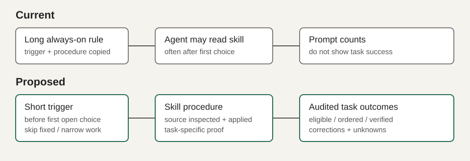

# Make the authored rules measurable and easier to follow

## Goal in three lines

The current audit counts prompts and skill reads; it cannot tell whether an eligible task followed a skill or whether the result survived review.
Replace repeated always-loaded Direction procedure with a short trigger, make task-specific closeout observable, and compare a pre-change sample with future tasks.
Prove it with a reproducible, privacy-safe audit of 20 eligible tasks, focused rule/skill checks, and `dotfiles/skills/bin/check`.

## Visual explanation



**Current.** [`skills/rules/core/direction-first.md`](../../skills/rules/core/direction-first.md) repeats the procedure in the [BLANK direction skill](../../../Desktop/CREATE/compronents/.agents/skills/blank-direction/SKILL.md). [`skills/bin/audit`](../../skills/bin/audit) reads user prompts only, and the Direction endpoint tests check protocol delivery, not agent use. The September 29 Smart Bandobast session read the skill but needed a user reminder to use Direction before choosing a path. The September 26 archive-chat session shows skill reads and searches followed by corrective requests. These examples are observations, not a controlled outcome study.

**Proposed.** The generated Claude/Codex/Grok/Pi/OpenCode instructions carry the short trigger; the task-specific skill carries source inspection and proof. An offline audit groups actual assistant actions by eligible user turn and produces aggregate scores, then a human reviews 20 sampled tasks with log locators. No agent transcript content is published.

```text
User request → short trigger → task skill → inspect/apply/verify → final evidence
                       ↘ offline audit of eligible turns ↗
```

### The audit rubric

Each sampled task is a row with `eligible`, `trigger-before-choice`, `source-inspected`, `changed-decision`, `runtime-verified`, `correction-followup`, and `unknown`, each with a brief evidence locator. `unknown` is not a pass or a fail. Fixed-source and narrow-edit cases are explicit negative controls. Reading a skill or seeing a catalog hit does not pass the source-inspected or changed-decision fields. An HTML or Markdown output summarizes counts by agent and task type, not one blended score. Start with the 20 most recent eligible completed tasks across Pi and Claude that have accessible action logs, selecting by timestamp before reading outcomes; report missing agents and incomplete sessions. Record the baseline before editing rules. Re-run the same scoring procedure on the next 20 eligible completed tasks when they exist, not on the same old logs, and do not claim an immediate behavior improvement from a config build.

## Files and responsibilities

| Source file | Today | Proposed |
| --- | --- | --- |
| `skills/bin/audit` | Aggregates user-prompt counts for Claude/Codex/Grok | Keep the historical summary; add a separate opt-in task-adherence command rather than changing its existing figures |
| `skills/bin/audit-adherence` (new) | None | Read assistant tool-call histories, group by user turn, generate candidate task rows with evidence locators and safe aggregate output; allow manual scoring without writing transcript text |
| `skills/tests/test_audit_adherence.py` (new) | None | Fixture tests for ordering, exclusion, incomplete turns, privacy and corrections across supported transcript shapes |
| `skills/profile/skill-adherence.md` (new) | None | Timestamped pre-change 20-task audit with denominators, selected log locators, manual judgments and uncertainty; post-change comparison section only after new tasks exist |
| `skills/rules/core/direction-first.md` | Trigger, research procedure and API reference in always-loaded text | Short decision trigger and explicit skill pointer; keep only essential bypass/closeout criteria |
| `skills/rules/core/direction-first.grok.md` | Separate compressed procedure | Match the same trigger and bypass within the Grok size limit |
| `skills/rules/core/aryan-voice.md` and `.grok.md` | Trigger plus repeated detail | Keep trigger; ensure copy closeout points to the skill rather than restating its guide |
| `skills/rules/shared/ui-verification.md` | Tool selection and web/device operating steps | Add a short observable UI closeout with matching viewport before/after evidence only when visual change is relevant; preserve existing tool routing |
| `skills/skills/animation-fundamentals/SKILL.md` | Motion recipe and verification instructions | Tighten the final proof to name input, observed result, interruption/reduced-motion when relevant |
| `skills/skills/aryan-voice/SKILL.md` | Voice guide and draft checklist | Require final copy shown with the surrounding UI/context, not a generic skill-read claim |
| `skills/skills/subsystem-modeling/SKILL.md` | Source-linked modeling procedure | Require a source-linked walkthrough only for complex explanations; keep small explanations small |
| `skills/skills/blank-mode/SKILL.md`, `router-process/SKILL.md`, `router-design/SKILL.md` | Potential routing overlap | Audit recent *eligible* Claude tasks before retiring any router; remove only a proven redundant pointer, otherwise retain and record why |
| `compronents/.agents/skills/blank-direction/SKILL.md` | Main research procedure, with some repeated trigger prose | Own detailed source-inspection and closeout steps; keep its existing source/action rules; do not change retrieval ranking |

Generated after approval: `skills/build/**` and live agent-rule installs via `skills/bin/build && skills/bin/install`. No generated file is hand-edited. The Compronents checkout already has uncommitted changes, including this skill; read its diff first and preserve those changes.

## Real code for real choices

The trigger becomes a pointer, not another copy of the research manual:

```diff
- ## Proactive procedure
- 1. Prefer MCP `direction_discover` ...
- 2. Scan all 8 to 12 candidates ...
+ Before the first open UI, page, component, or tool choice, load `blank-direction`
+ and run `direction_discover`. For a supplied exact source or a narrow edit,
+ skip discovery; use `direction_lookup` only when a concrete need requires it.
+ At closeout, name the inspected source, the decision it changed, and how
+ the result was checked. If no source changed the work, say so.
```

The actual phrasing must retain backend library/pattern choices and the existing bypass for bug fixes. No rule may force discovery for a fixed-source task. Keep endpoint syntax in the skill and tests, not five generated AGENTS files.

The audit command should parse tools as structured events, not grep rendered transcripts:

```python
# Proposed logic, not implemented
for turn in parse_user_turns(session):
    evidence = actions_until_next_user_turn(turn)
    row = score_ordering_and_observations(turn, evidence)
    # Human reviews eligibility, whether a source changed the work,
    # and whether a later correction concerns that same task.
```

Do not store raw prompts, tool arguments, access tokens, or user images in output. Use session basename, date, event ordinal, and short human-written labels as locators. Document why a missing or interrupted turn stays `unknown`.

## Scope left out

No change to Direction retrieval ranking, MCP routes, agent model settings, source catalog, or third-party skill installations. A transcript audit cannot prove a source was understood or a design was good; manual review supplies those judgments. Later user correction can concern another feature, so correction matching is manual. A new baseline cannot measure post-change improvement until new tasks finish. Do not delete routers on usage counts alone. Re-check affected links and tests, run `skills/bin/build --check` and `skills/bin/check`, then inspect generated and installed rule text. Verify the new CLI against fixture logs and at least two real sessions without printing transcript bodies. Run the same audit on the next 20 eligible tasks and compare per-field rates with the baseline.
