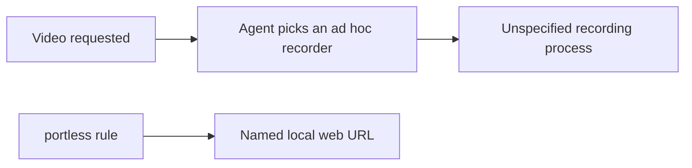
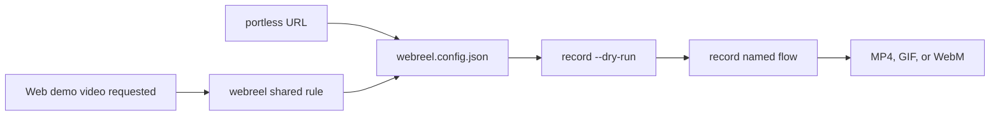

# Add webreel as a shared agent tool

## 1. Goal in three lines

The dotfiles currently tell agents how to run and verify web apps, but they do not name a repeatable way to produce browser demo videos.
Add a shared `webreel` rule beside `portless` so every configured coding agent can record scripted web flows when a video artifact is requested.
Prove it by building every agent profile, checking generated-file drift, dry-running installation, and confirming the installed global rules contain the trigger and commands.

## 2. Visual explanation

### Current



`skills/rules/shared/portless.md` standardizes local URLs, but no peer rule owns browser demo recording. Agents may use a screenshot tool, a native screen recorder, or a throwaway browser script even when the requested deliverable is a repeatable web demo.

### Proposed



The new rule will fire for browser product demos, tutorials, changelog clips, and repeatable video walkthroughs. It will not replace Agent Browser for ordinary web QA or Argent for native, React Native, device, Electron, or CDP recording.

The recording path will be:

1. Use the existing named portless URL when recording a local web app.
2. Create or reuse `webreel.config.json` with the official v1 schema.
3. Describe the flow as reviewable JSON steps.
4. Run `npx webreel validate -c <config>`, then `npx webreel record -c <config> <name> --dry-run` before opening Chrome.
5. Run `npx webreel record -c <config> <name>` and report the exact output path.
6. If Chrome or FFmpeg setup fails, retry once and preserve the exact error. Never delete `~/.webreel` without approval.

Official behavior checked against [webreel quick start](https://webreel.dev/quick-start), [configuration](https://webreel.dev/configuration), and [commands](https://webreel.dev/commands).

## Implementation finding

The first build exposed pre-existing Grok budget pressure. Grok's profile is already 9,961 characters before webreel, so even the short webreel rule pushes it to 10,872 and the build correctly refuses to write anything. The cause is `unslop.md`: Grok is documented as taking short forms only, but unslop has no `.grok.md` form and contributes 6,480 characters by itself.

The revised proposal adds `unslop.grok.md`, a compact rule preserving the full rule's operative requirements: plain concrete speech, no AI filler or promotional language, no mannered punctuation, active voice, sentence rhythm, and a final AI-tell audit. The full unslop rule remains unchanged for every other agent. This reduces Grok's generated profile rather than raising the 10,000-character cap or allowing truncation.

## 3. File table

| File | Today | After |
| --- | --- | --- |
| `skills/rules/shared/webreel.md` | Missing. | Full shared rule with trigger, boundary against existing verification tools, config workflow, dry run, recording, output reporting, and dependency recovery. |
| `skills/rules/shared/webreel.grok.md` | Missing. | Short form carrying the same trigger and required workflow within Grok's 10,000-character budget. |
| `skills/rules/core/unslop.grok.md` | Missing, so Grok receives the 6,480-character full rule. | Compact Grok-specific form preserves the required writing behavior and frees enough context for webreel. |
| `skills/rules/tiers.toml` | Every agent receives `portless`, but none receives webreel. | Adds `webreel` directly after `portless` for Claude, Codex, Grok, Pi, and OpenCode. |
| `skills/build/claude/rules/webreel.md` | Missing generated output. | Generated Claude rule. |
| `skills/build/{codex,grok,pi,opencode}/AGENTS.md` | No webreel section. | Generated profiles include the new section. Existing unrelated dirty changes remain intact because the build is source-driven. |
| `~/.claude/rules/webreel.md`, `~/.codex/AGENTS.md`, `~/.grok/AGENTS.md`, `~/.pi/agent/AGENTS.md`, `~/.config/opencode/AGENTS.md` | No installed webreel rule. | Installed outputs match `skills/build/`. These are machine outputs, not repository files. |

## 4. Real code for real choices

### Shared rule placement

```diff
 [claude]
 shared = [
   "ui-verification",
   "argent",
   "portless",
+  "webreel",
   "waiting",
   "context7",
   "plannotator",
 ]
```

The same ordered addition applies to Codex, Grok, Pi, and OpenCode. Placement beside `portless` makes local URL setup precede recording.

### Trigger and tool boundary

```diff
+# Browser demo videos with webreel
+
+Use webreel when the requested artifact is a repeatable browser demo video,
+tutorial, changelog clip, or scripted web walkthrough.
+
+Keep ordinary web QA in Agent Browser. Keep native, React Native, device,
+Electron, and CDP screen recording in Argent.
```

This prevents webreel from taking over every visible UI verification task.

### Reviewable recording workflow

```diff
+1. Use the app's named portless URL for local recordings.
+2. Create or reuse `webreel.config.json`; keep the config with the artifact when the flow should be repeatable.
+3. Run `npx webreel validate -c <config>` and inspect config errors.
+4. Run `npx webreel record -c <config> <name> --dry-run`, then record the named flow.
+5. Report the config path, named flow, output path, format, and any simulated data.
```

The rule uses `npx` because the official setup documents a project package and `npx webreel`. It will not require or silently perform a global install.

### Grok budget fix

```diff
+# Unslop
+
+Write plain, concrete prose with a human voice. Cut AI filler, promotional
+language, vague attribution, forced patterns and abstract technical metaphors.
+Prefer active voice, short sentences and exact facts. Avoid em dashes, title
+case headings, decorative emoji and excessive bold labels. Before sending,
+ask what makes the text look AI-generated and rewrite those parts.
```

This is an agent-specific short form. It does not change the full unslop source used by Claude, Codex, Pi, or OpenCode.

### Recovery

```diff
+Chrome and FFmpeg live under `~/.webreel` and download on first use.
+Use `validate` and `--dry-run` to separate config errors from browser or encoder errors.
+Retry a failed dependency download once. Never delete `~/.webreel` without approval.
```

## 5. Scope left out

- No global `npm install -g webreel`. The rule uses the official project-local and `npx` path.
- No automatic `webreel.config.json` added to unrelated projects. Agents create one only when a requested recording needs it.
- No replacement for Agent Browser or Argent verification flows.
- No sample video will be recorded while changing the dotfiles. Verification covers rule generation and installation, not webreel's runtime against a product app.
- The full unslop rule remains unchanged. Only Grok receives the compact short form.
- The dotfiles checkout already has unrelated edits in direction-first files and generated profiles. The implementation will not rewrite their source changes. Generated profiles will still contain them because `skills/bin/build` renders the complete current source tree.
