# How this actually works

You have one repo that decides how three AI agents behave. This explains what happens, when, and
what you do day to day.

## The one-sentence version

You edit a text file, run two commands, and every agent on this machine starts behaving differently
the next time you open it.

---

## There are only two loops

Everything here is one of two things. Confusing them is why the system feels unclear.

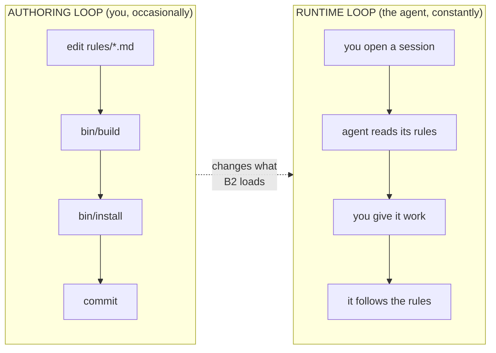

The authoring loop runs when you want to change behaviour. Maybe once a week.

The runtime loop runs every time you talk to any agent. You never touch the repo during it.

**The two loops never overlap.** That is the single most important thing. A rule you edit right now
does not affect the session you are currently in. It affects the next one.

---

## Where everything lives

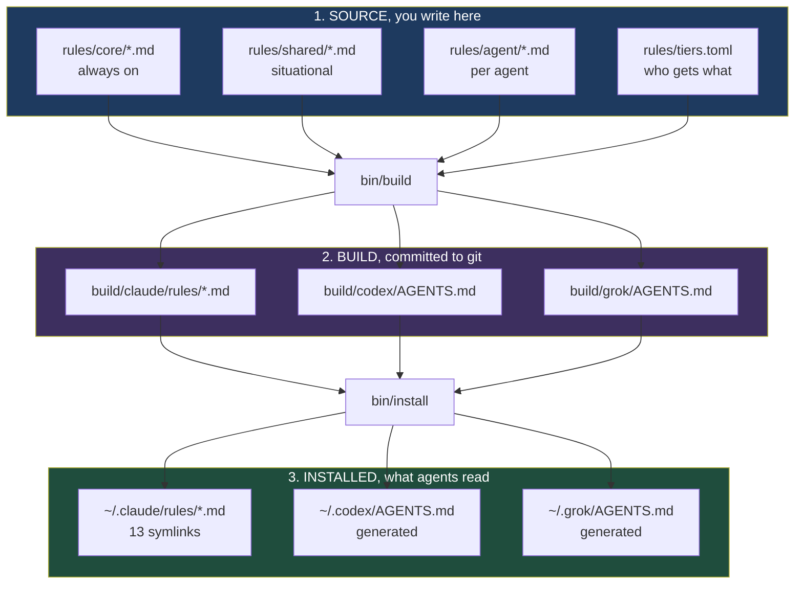

Three layers, and you only ever touch the first one.

The middle layer exists so you can **read exactly what each agent sees** and `git diff` it. That is
what makes this a source of truth instead of a script that does mysterious things to your home
directory.

**Never edit layer 3.** `~/.codex/AGENTS.md` and `~/.grok/AGENTS.md` carry a `GENERATED FILE, DO NOT
EDIT` header. The next `bin/build` overwrites anything you put there. This already happened to you
once: four rules were sitting in `~/.codex/AGENTS.md` and nowhere else, drifting alone for months.

---

## What happens when you open a session

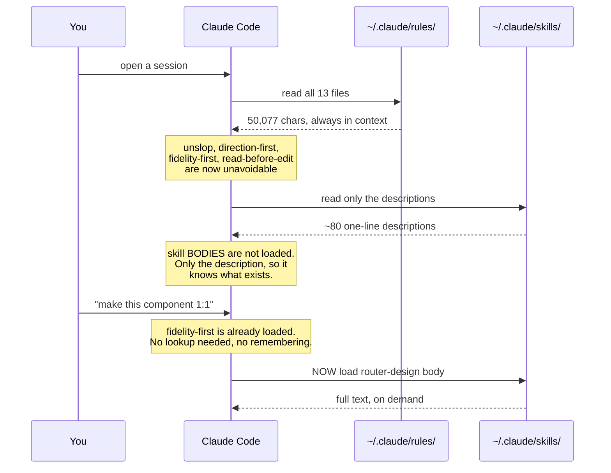

This is the distinction that makes the whole design work.

**Rules are always loaded.** All 13 files, every turn, no exceptions. They cost context permanently,
which is why there are only 13 and why Grok has a hard cap.

**Skills are loaded on demand.** The agent sees a one-line description and pulls the body only when
relevant. That is why `router-design` can be 18KB and cost nothing until design work starts.

A rule is for something that must be true every turn. A skill is for something needed occasionally.
Putting a skill's content in a rule wastes context on every turn; putting a rule's content in a skill
means it fires only when the agent happens to notice.

---

## Why the agent used to ignore your config

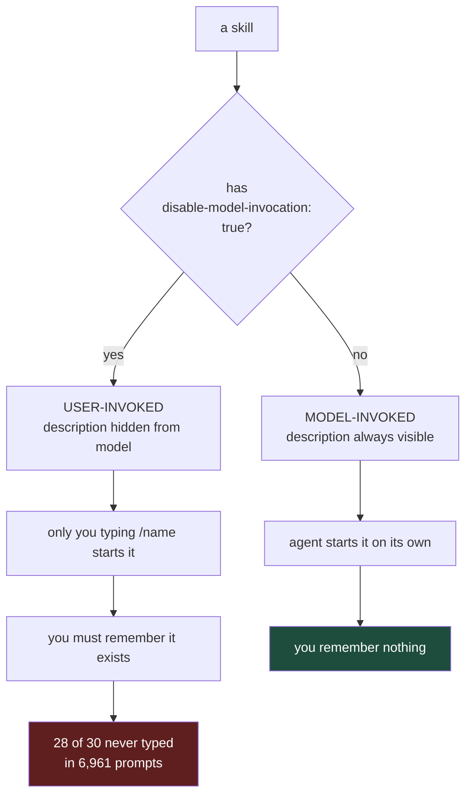

That one frontmatter line was the whole problem. Not the content of your skills, which was good.

The fix has three parts:

1. The four things that must always apply became **rules**, not skills. They cannot be missed.
2. `blank-mode` and the two routers are **model-invoked**, so the agent finds the rest without you.
3. The remaining 56 slash-only skills stay slash-only, but `router-process` lists them, so the agent
   can read what exists and reach for one by name.

---

## Real walkthrough 1: you say "make this 1:1"

This is your most-corrected category, 174 prompts.

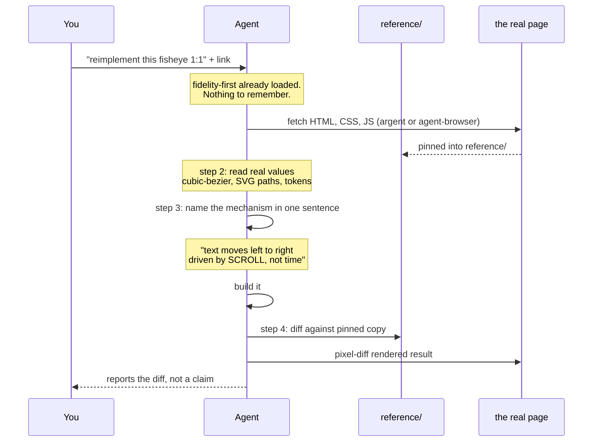

**Before**, the agent looked at a screenshot, built something that resembled it, and said done. You
replied "it's genuinely not 1:1, instead of a convex effect u did a concave one."

**After**, step 3 forces it to state the mechanism before building. Convex against concave is exactly
the error that step catches, because you cannot write that sentence wrong and still build the wrong
thing silently.

Step 5 is the one that changes your experience most: it reports the diff rather than claiming a
match.

---

## Real walkthrough 2: you ask "what should I use for X"

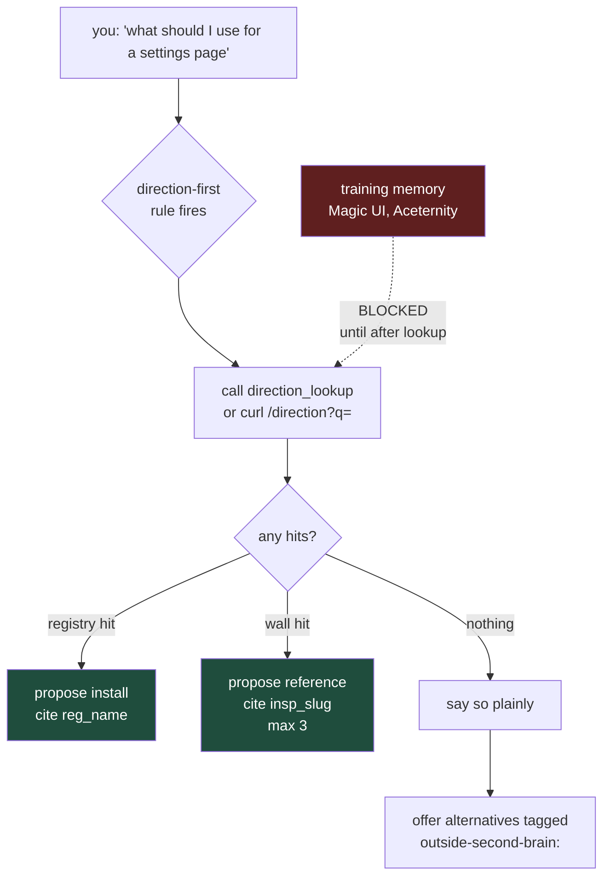

You built `/inspo` to put things **into** this registry and used it 77 times. You never built the way
to get things **out**, so the agent answered from training memory instead and your 1,100 curated
entries went unused.

Four separate rules described this protocol and produced zero uses, because they were advice. One
rule with a named trigger and four numbered steps replaced them.

The anti-pattern arrow matters as much as the steps: naming a library before the lookup is the
specific behaviour being blocked.

---

## Real walkthrough 3: you want to change how an agent behaves

This is the authoring loop. Say Codex keeps committing without being asked.

```bash
# 1. edit the source. One file, plain markdown.
$ vim ~/dotfiles/skills/rules/agent/codex.md

# 2. render it. Fails loudly if you blew a budget.
$ cd ~/dotfiles/skills && bin/build
  claude  13 rules   50077 chars
  codex   12 rules   46776 chars
  grok     4 rules    8875 chars  cap 10000
  built 15 files, 2 changed.

# 3. put it on disk.
$ bin/install
  codex:
    write /Users/blank/.codex/AGENTS.md

# 4. prove nothing broke.
$ bin/check
  all checks passed.

# 5. keep it.
$ git -C ~/dotfiles add skills && git -C ~/dotfiles commit -m "codex: never commit unasked"
```

Total time: about a minute. The next Codex session has the new behaviour. Sessions already open do
not, because rules load at start.

If you had edited `~/.codex/AGENTS.md` directly instead, step 2 in a week's time would silently erase
it.

---

## Why the three agents get different files

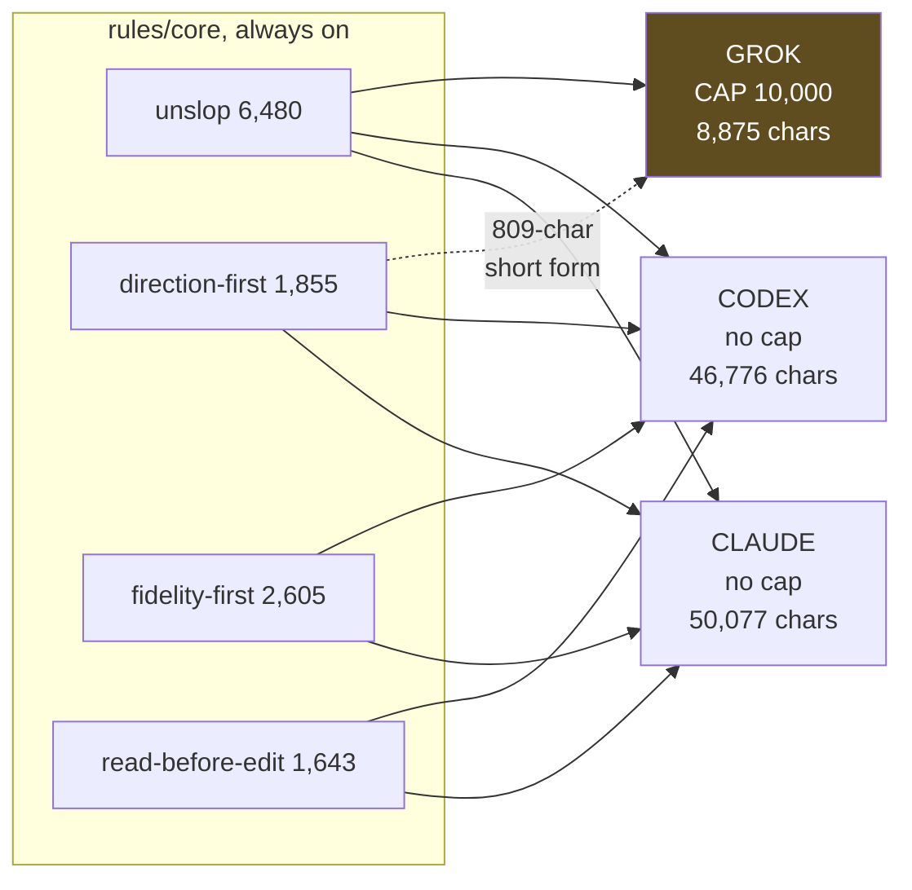

Grok truncates its instruction file at 10,000 characters. Silently. Anything past that just does not
exist as far as Grok is concerned.

So rules are tiered in `rules/tiers.toml`. A rule can ship a short form named `<name>.grok.md`, which
wins for Grok only. `direction-first` has one at 809 chars against the full 1,855.

Grok does not get `fidelity-first` or `read-before-edit` at all. That is not an oversight. Your Grok
prompts are agent plumbing, WhatsApp bridges, and headless runs. Its aesthetic-judgment rate is 1.0
per 10k chars against Claude's 3.4. It does no component work, so those rules would spend a third of
its budget on something it never does.

`bin/build` refuses to write when a tier overflows. It will not silently hand Grok a truncated file.

---

## What happens when you install someone's skills

This is the part that bit us twice, so it has its own loop.

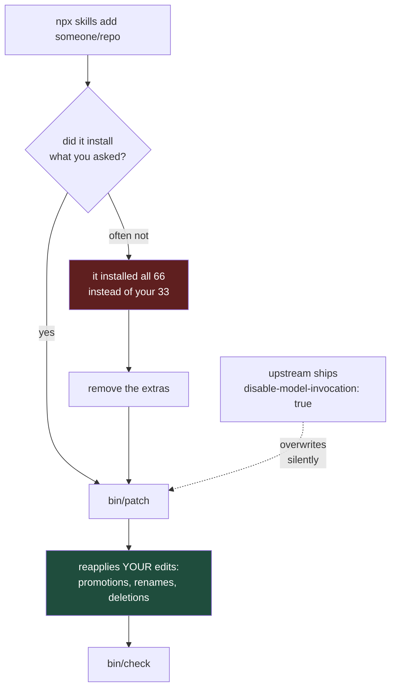

Two real failures, both caught during this build:

**The `-s` filter does not reliably filter.** Asking for 33 named pstack skills installed all 66 in
the repo, including a `tdd` that replaced the symlink to Matt Pocock's same-named skill. Nothing
warned. Always diff what landed against what you asked for.

**A reinstall silently reverts your edits.** You promoted `writing-for-agents` to fire automatically.
Upstream still ships it slash-only, so reinstalling it put the flag back. `vendored/*/patches.toml`
declares your edits and `bin/patch` replays them, which is why that promotion survives.

---

## The skills you imported, and how you reach each one

You own 80 skills from three people. They are not all reached the same way, and that is the part
that was confusing.

| Source | Installed | Fires by itself | You type it |
|---|---|---|---|
| Matt Pocock | 38 | 16 | 22 |
| Dillon Mulroy | 8 | 3 | 5 |
| poteto pstack | 34 | 5 | 29 |
| **total** | **80** | **24** | **56** |

### Three ways a skill gets reached

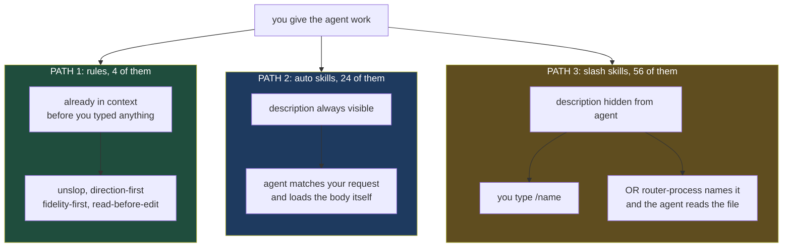

Path 3 is what changed. A slash-only skill used to be unreachable unless you remembered it existed,
which is why 28 of them were never typed once. `router-process` now lists all 56 with their purpose,
so the agent can find one and read `~/.claude/skills/<name>/SKILL.md` directly. It cannot "invoke"
the skill, but it can read and follow it, which is the same outcome.

### Matt Pocock, 38 skills, engineering process

**Fires by itself:** `code-review`, `tdd`, `diagnosing-bugs`, `codebase-design`, `domain-modeling`,
`design-an-interface`, `prototype`, `qa`, `research`, `grilling`, `request-refactor-plan`,
`resolving-merge-conflicts`, `migrate-to-shoehorn`, `scaffold-exercises`, `setup-pre-commit`,
`git-guardrails-claude-code`, `obsidian-vault`.

**You type:** `/implement`, `/triage`, `/to-spec`, `/to-tickets`, `/handoff`, `/teach`, `/wizard`,
`/wayfinder`, `/ask-matt`, `/grill-me`, `/edit-article`, the four `/writing-*` skills, and the rest.

One catch worth knowing. `/to-spec`, `/to-tickets`, and `/triage` form a chain that expects per-repo
config: an issue tracker and a triage label vocabulary. Run `/setup-matt-pocock-skills` once in a
repo before using them, or they will not know where to file anything.

`/ask-matt` is his router over the other 37. It is itself slash-only, which is why it never fired.

### Dillon Mulroy, 8 skills, code and writing discipline

**Fires by itself:** `write-discoverable-code` (naming so agents can grep your code),
`writing-for-agents` (how to write a SKILL.md or a rule), `use-computer-mcp`.

**You type:** `/bro` (restate the last message in plain language, your most-used slash command at 4
uses), `/coding-standards`, `/herdr`, `/cloudflare-composition-root`, `/recipe-diagrams`.

The first two fire by themselves **only because we patched them**. Upstream still ships
`writing-for-agents` as slash-only. That patch lives in `vendored/dmmulroy/patches.toml` and
`bin/patch` replays it after every install. Without it, the next reinstall silently makes it
unreachable again.

`use-computer-mcp` will fail if invoked: its Open Computer Use MCP is not configured here. Either add
the MCP or delete the skill.

### poteto pstack, 34 skills, principles and playbooks

**Fires by itself:** `unslop` (also promoted to a rule, so it applies twice over),
`typescript-best-practices`, `why`, `how`, `setup-pstack`.

**You type:** `/poteto-mode` is the entry point, plus 20 `principle-*` skills, `/architect`,
`/reflect`, `/interrogate`, `/arena`, `/figure-it-out`, `/show-me-your-work`, `/automate-me`,
`/pstack-tdd`.

The 20 `principle-*` skills are the ones doing real work for you, because four of them cover four of
your six failure modes:

| Your failure | The principle |
|---|---|
| said done without running it | `/principle-prove-it-works` |
| rewrote code that was already right | `/principle-subtract-before-you-add` |
| stopped at a plan instead of finishing | `/principle-outcome-oriented-execution` |
| lost the thread on long work | `/principle-guard-the-context-window` |

`/poteto-mode` is his personal routing skill. `blank-mode` is yours, built from your own audit, and it
fires automatically where his does not. Both can coexist.

`/automate-me` is worth knowing about: it mines your transcripts and drafts a `<name>-mode` skill. It
is the tool that would have produced `blank-mode` had we not done that pass by hand first.

### Importing a new source

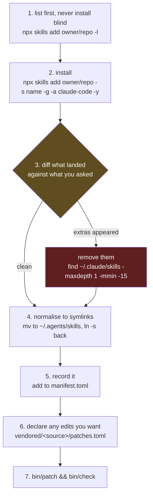

The concrete commands:

```bash
# 1. see what is in there before installing anything
npx skills@latest add poteto/plugins -l

# 2. install (repeat -s per skill; a comma-separated list installs NOTHING)
npx skills@latest add poteto/plugins -s unslop -s architect -g -a claude-code -y

# 3. what actually landed in the last 15 minutes?
find ~/.claude/skills -maxdepth 1 -mmin -15 -exec basename {} \;

# 4. reapply your edits, then verify everything
cd ~/dotfiles/skills && bin/patch && bin/check
```

**Step 3 is not optional.** Installing 33 named pstack skills installed all 66 in that repo,
including a `tdd` that silently replaced Pocock's same-named skill. The `-s` filter is not reliable
on a multi-plugin repo, and nothing warns you.

For Codex or Grok instead of Claude, change `-a claude-code` to `-a codex` or `-a grok`. That is the
only difference. Skills are per-agent; rules are what this repo unifies across all three.

### What to actually type

| You want | You type | Or it just happens |
|---|---|---|
| a plain-English restatement | `/bro` | |
| to stress-test an idea | | `grilling` fires on its own |
| to review a branch | | `code-review` fires on its own |
| to debug something hard | | `diagnosing-bugs` fires on its own |
| rigorous engineering mode | `/poteto-mode` | or `blank-mode` fires on its own |
| to apply one principle | `/principle-prove-it-works` | |
| to see what skills exist | | `router-process` fires on its own |
| design or motion craft | | `router-design` fires on its own |
| to clean AI tells from writing | | `unslop` is a rule, always on |
| a library recommendation | | `direction-first` is a rule, always on |

The right-hand column is the goal. Anything still in the left column is something you have to
remember, and the audit says you will not.

---

## What you actually do, day to day

Almost nothing. That is the point.

| When | You do | Time |
|---|---|---|
| Normal work | nothing, rules are already loaded | 0 |
| Change a behaviour | edit a rule, `bin/build && bin/install` | 1 min |
| Install someone's skills | install, then `bin/patch && bin/check` | 2 min |
| Agent ignored a rule | make that rule more specific, rebuild | 5 min |
| New machine | clone, `bin/install` | 1 min |
| Wondering what an agent sees | read `build/<agent>/` | 0 |

If you never touch the repo again, everything keeps working. It is not a system that needs feeding.

---

## How you know it is working

The honest test is behavioural, and it is the one thing I cannot verify for you from inside a session
that predates the rules.

Next session, without mentioning any of this:

1. Point at a component and say "make this 1:1". Watch for a `reference/` folder and a diff. If it
   eyeballs a screenshot, `fidelity-first` is too weak.
2. Ask "what should I use for X". Watch for a `reg_` or `insp_` citation before any library name. If
   it names Magic UI first, `direction-first` is too weak.
3. Say something in a component is wrong. Watch whether it reads the whole file and names the cause
   in one sentence before editing.

Each failure is a line in `rules/core/`, not a thing you have to remember.

---

## When something looks wrong

```bash
cd ~/dotfiles/skills

bin/check              # every invariant at once, exits 1 on breakage
bin/build --check      # is build/ stale against rules/?
bin/patch --check      # did an install revert one of your edits?
bin/audit              # re-derive the numbers from live history
```

`bin/check` is the one to run. It covers drift, budgets, patches, generated headers, broken symlinks,
em dashes, and git state in one command.

Common cases:

**"The agent ignored my rule."** Was the session open before you ran `bin/install`? Rules load at
start. Open a new one.

**"My change vanished."** You edited `~/.codex/AGENTS.md` or `~/.grok/AGENTS.md` instead of
`rules/`. Both say so at the top. Move it into `rules/` and rebuild.

**"A skill stopped firing on its own."** An install reverted a patch. Run `bin/patch`.

**"Build refuses to run."** Grok would go over 10,000 chars. Write a `<name>.grok.md` short form, or
drop that rule from Grok's tier.

---

## The whole thing in one picture

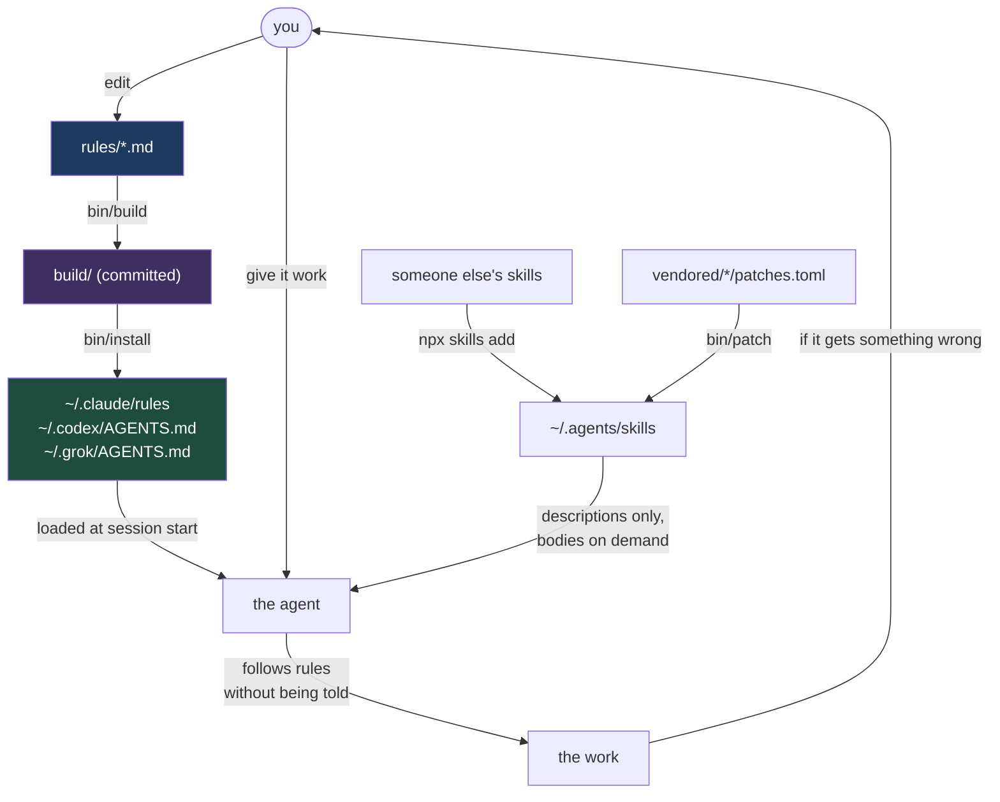

The loop closes at the bottom left. When the agent gets something wrong, that correction becomes a
rule, and the same mistake stops happening across all three agents at once.

That is the actual point of the whole thing. Not the tooling. The tooling just makes the loop cheap
enough that you will bother to close it.
